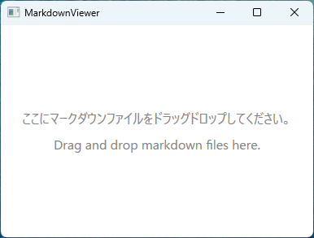
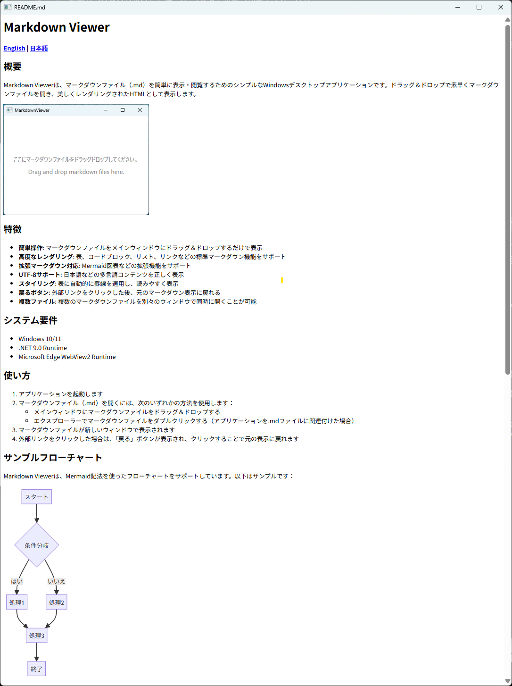
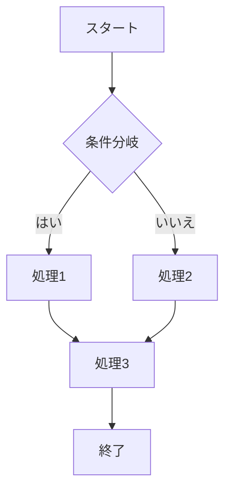
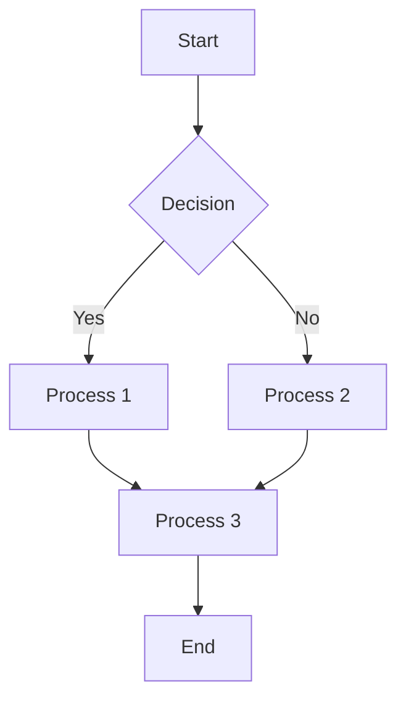

# Markdown Viewer

**[English](#english) | [日本語](#japanese)**

<a id="japanese"></a>

## 概要

Markdown Viewerは、マークダウンファイル（.md）を簡単に表示・閲覧するためのシンプルなWindowsデスクトップアプリケーションです。ドラッグ＆ドロップで素早くマークダウンファイルを開き、美しくレンダリングされたHTMLとして表示します。

 


## 特徴

- **簡単操作**: マークダウンファイルをメインウィンドウにドラッグ＆ドロップするだけで表示
- **高度なレンダリング**: 表、コードブロック、リスト、リンクなどの標準マークダウン機能をサポート
- **拡張マークダウン対応**: Mermaid図表などの拡張機能をサポート
- **UTF-8サポート**: 日本語などの多言語コンテンツを正しく表示
- **スタイリング**: 表に自動的に罫線を適用し、読みやすく表示
- **戻るボタン**: 外部リンクをクリックした後、元のマークダウン表示に戻れる
- **複数ファイル**: 複数のマークダウンファイルを別々のウィンドウで同時に開くことが可能

## システム要件

- Windows 10/11
- .NET 9.0 Runtime
- Microsoft Edge WebView2 Runtime

## インストール方法

1. [リリースページ](https://github.com/yourorganization/markdown-viewer/releases)から最新の「MarkdownViewer.msi」をダウンロードします
2. ダウンロードしたMSIファイルをダブルクリックします
3. インストールウィザードの指示に従ってインストールを完了します
4. インストール完了後、スタートメニューまたはデスクトップのショートカットからアプリケーションを起動できます

## 使い方

1. アプリケーションを起動します
2. マークダウンファイル（.md）を開くには、次のいずれかの方法を使用します：
   - メインウィンドウにマークダウンファイルをドラッグ＆ドロップする
   - エクスプローラーでマークダウンファイルをダブルクリックする（アプリケーションを.mdファイルに関連付けた場合）
3. マークダウンファイルが新しいウィンドウで表示されます
4. 外部リンクをクリックした場合は、「戻る」ボタンが表示され、クリックすることで元の表示に戻れます

## サンプルフローチャート

Markdown Viewerは、Mermaid記法を使ったフローチャートをサポートしています。以下はサンプルです：

```text
flowchart TD
    A[スタート] --> B{条件分岐}
    B -->|はい| C[処理1]
    B -->|いいえ| D[処理2]
    C --> E[処理3]
    D --> E
    E --> F[終了]
```


## ライセンス

このアプリケーションは、Markdigライブラリ（BSD 2-Clause）とMicrosoft WebView2（Microsoft Software License Terms）を使用しています。

---

<a id="english"></a>

## Overview

Markdown Viewer is a simple Windows desktop application for easily viewing markdown (.md) files. Simply drag and drop markdown files to open and display them as beautifully rendered HTML.

## Features

- **Easy Operation**: Just drag and drop markdown files to the main window to display
- **Advanced Rendering**: Support for standard markdown features including tables, code blocks, lists, and links
- **Extended Markdown Support**: Supports extensions like Mermaid diagrams
- **UTF-8 Support**: Correctly displays multilingual content including Japanese
- **Styling**: Automatically applies borders to tables for improved readability
- **Back Button**: Return to the original markdown display after clicking external links
- **Multiple Files**: Open multiple markdown files in separate windows simultaneously

## System Requirements

- Windows 10/11
- .NET 9.0 Runtime
- Microsoft Edge WebView2 Runtime

## Installation

1. Download the latest "MarkdownViewer.msi" from the [releases page](https://github.com/yourorganization/markdown-viewer/releases)
2. Double-click the downloaded MSI file
3. Follow the installation wizard instructions to complete the installation
4. After installation, you can launch the application from the Start menu or desktop shortcut

## How to Use

1. Launch the application
2. To open a markdown file (.md), you can:
   - Drag and drop the markdown file into the main window
   - Double-click on a markdown file in Explorer (if the application is associated with .md files)
3. The markdown file will be displayed in a new window
4. When clicking external links, a "Back" button will appear which allows you to return to the original display

## Sample Flowchart

Markdown Viewer supports flowcharts using Mermaid syntax. Here's an example:

```text
flowchart TD
    A[Start] --> B{Decision}
    B -->|Yes| C[Process 1]
    B -->|No| D[Process 2]
    C --> E[Process 3]
    D --> E
    E --> F[End]
```



## License

This application uses the Markdig library (BSD 2-Clause) and Microsoft WebView2 (Microsoft Software License Terms).